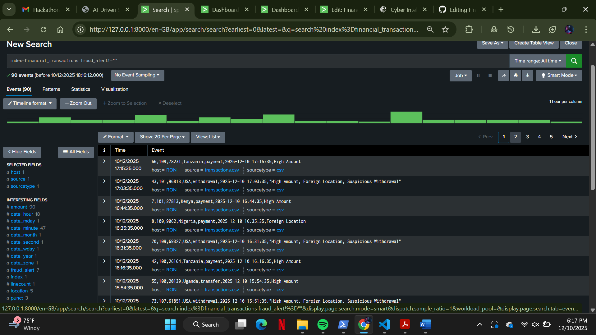
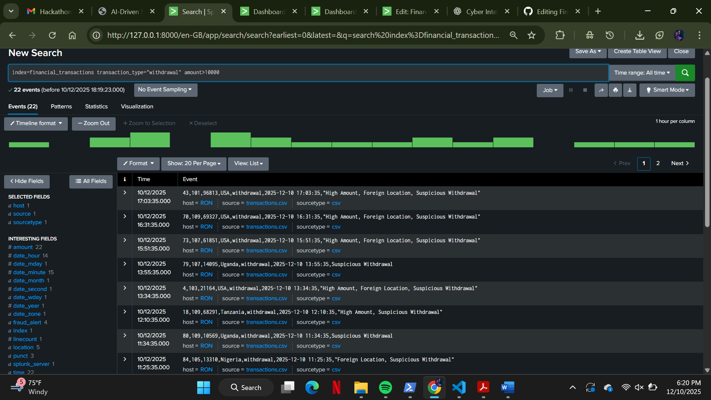
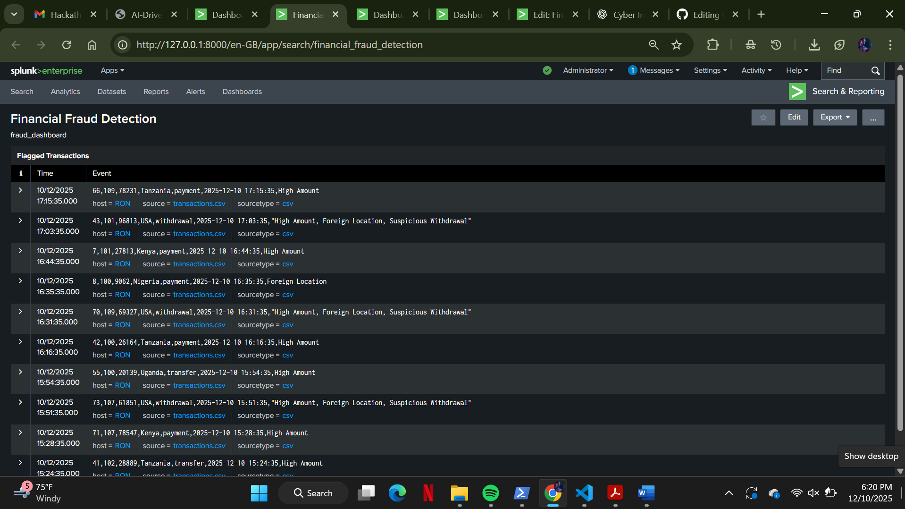
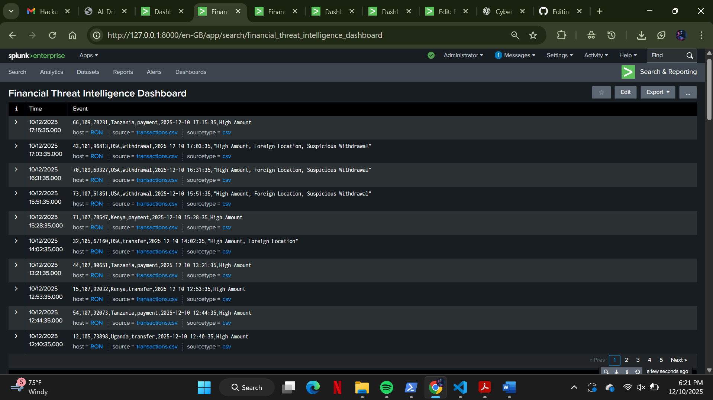
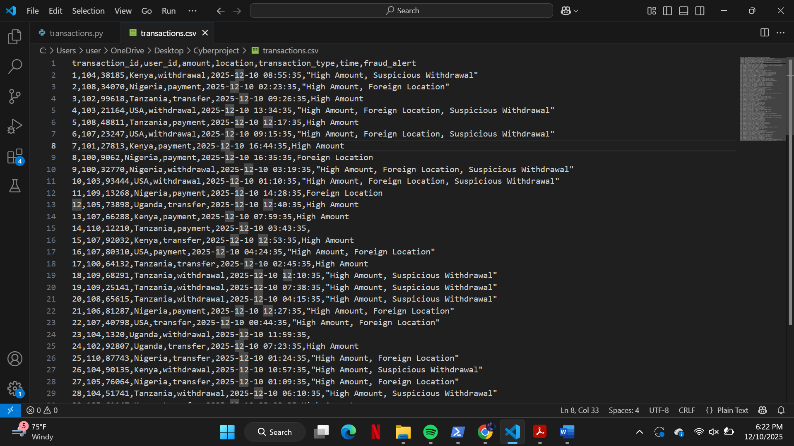
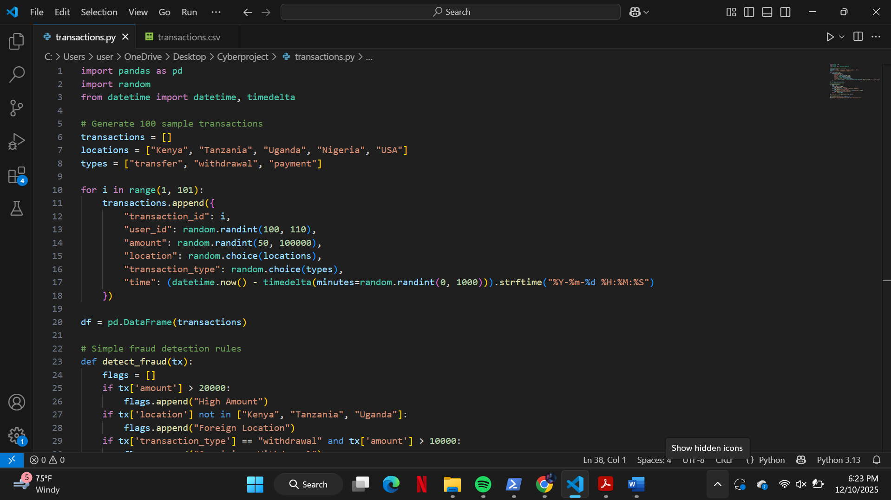

# Financial Threat Intelligence System

## 🚀 Project Overview
The **Financial Threat Intelligence System** detects fraudulent financial transactions, identifies suspicious activity, and provides real-time visibility into threats targeting financial systems.  

This project uses **Python** to generate synthetic transactions and **Splunk** for data ingestion, dashboards, and alerts. It is a practical demonstration of **financial cyber intelligence** suitable for blue-team workflows.

---

## 🛠 Tools & Technologies
- **Python 3.x** – generates synthetic financial transactions  
- **Splunk Enterprise / Free** – SIEM for analysis, dashboards, and alerts  
- **Pandas / Matplotlib** – optional for data analysis

---

## ⚡ Features
- Generates realistic banking transactions (payments, withdrawals, transfers)  
- Detects **high-risk transactions**:
  - High amount  
  - Foreign location  
  - Suspicious withdrawal patterns  
- Real-time dashboards:
  - High Amount Transactions  
  - Transactions by Country  
  - Fraud Alerts Summary  
  - Transaction Type Distribution  
  - Transaction Volume Over Time  
- Alerts for automatic notification of suspicious activity  
- Risk scoring and anomaly detection  

---

## 📊 Dataset / Fields
| Field | Description |
|-------|-------------|
| transaction_id | Unique ID for each transaction |
| user_id | Account ID of the user |
| transaction_type | Type of transaction (payment, withdrawal, transfer) |
| amount | Transaction amount |
| location | Country of transaction |
| fraud_alert | Risk flags: High Amount, Foreign Location, Suspicious Withdrawal |
| time / _time | Timestamp of transaction |

---

## 🏗 System Architecture
1. **Python** generates synthetic transactions → `transactions.csv`  
2. **Splunk** ingests CSV in real-time  
3. **SPL queries** analyze patterns & anomalies  
4. **Dashboards** visualize high-risk transactions  
5. **Alerts** notify analysts  

## 🖼 Screenshots

Splunk index alert dashboard

Dashboard showing withdrawal transactions

Dashboard for fraud detection

Overall threat intelligence dashboard

transactions.csv open in VS Code

transactions.py script in VS Code

## 📑 Project Report
[Download Project Report](Financial%20Intelligence%20Project%20Report.docx)
### cybersecurity, blue-team, financial-fraud, splunk, python, threat-intelligence

